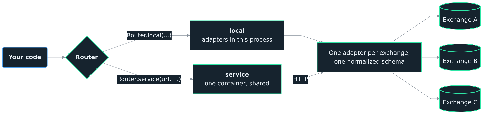

<h1>OCEΛNO <small><code>exchange-router</code></small></h1>


<div style="padding-top: 0px;">
  <a href="https://github.com/atOCEANO/exchange-router-service/releases"></a>
  <a href="https://www.python.org/downloads/"></a>
  <a href="https://fastapi.tiangolo.com/"></a>
  <a href="https://opensource.org/licenses/MIT"></a>
</div>

<sub>
  <b>Introduction</b> &nbsp;•&nbsp;
  <a href=".Documentation/Python_API.md">Python API</a> &nbsp;•&nbsp;
  <a href=".Documentation/HTTP_Reference.md">HTTP Reference</a> &nbsp;•&nbsp;
  <a href=".Documentation/Exchange_Notes.md">Exchange Notes</a> &nbsp;•&nbsp;
  <a href=".Documentation/Architecture.md">Architecture</a> &nbsp;•&nbsp;
  <a href=".Documentation/Decisions.md">Decisions</a> &nbsp;•&nbsp;
  <a href=".Documentation/Adapter_Guide.md">Adapter Guide</a> &nbsp;•&nbsp;
  <a href=".Documentation/Contributor_Guide.md">Contributor Guide</a> &nbsp;•&nbsp;
  <a href=".Documentation/Auditor_Guide.md">Auditor Guide</a>
</sub>

<br>
<br>
<br>
<br>

## Introduction

The `exchange-router` is **one Python API over public crypto exchange market data, running either in your own process or against a service you deploy**. Every registered adapter speaks the same schema, so a client written once works across all of them. The currently supported set is listed in [Supported Exchanges](#supported-exchanges) below.

```python
from exchange_router import Router

r = Router.local(exchanges=["binance"])                            # adapters in this process
r = Router.service("http://localhost:8040", exchanges=["binance"]) # adapters behind a container

df = r.market("binance", "perp", "BTCUSDT").candles("1h", limit=500)
```

One line differs. Everything below it is the same object, with the same methods, returning the same types.

Field names, units, funding conventions, and pagination semantics differ from one exchange to the next. The router does that translation in the adapter layer, so callers see the same `Ticker`, `Candle`, `OrderBook`, `MarkPrice`, `FundingRate` shape regardless of which exchange served the request. It also handles the parts every integration needs: pagination for large historical pulls, request-weight throttling to prevent IP bans, and persistent connection management for WebSocket streams. Adding a new exchange means dropping in a new adapter, with no changes to the routing core.

**Stateless and keyless.** The router handles public market data only. It places no orders, holds no API keys, manages no accounts, and persists nothing to disk. If you need authentication or private endpoints, this is not it. See [Scope](#scope) for the full list of non-goals and deployment assumptions before pointing real traffic at it.

<br>

### Which mode to use

The modes are functionally identical and operationally different. Local can do everything the service can; what it cannot do is coordinate, because coordination needs one process.

| | `local` | `service` |
| :--- | :--- | :--- |
| weight budget | per process | shared by every caller |
| symbol cache | per process | shared, 24h, already warm |
| WebSocket upstreams | one per subscription | one per key, fanned out |
| blast radius | your IP | one service you can restart |
| what you deploy | nothing | one container |

**Local** is for one person in one process: a notebook or a script, nothing to deploy and nothing to keep running. A heavy single-process backfill is a fine reason to stay local.

**The service** is for more than one of anything: more than one caller, anything scheduled or long-running, several notebooks at once. Each local process carries its own rate-limit budget and the exchange sees the sum.

<br>

<div align="center">
  
  <p style="margin: 0;"><i>One API, two ways to run it: the adapters either live in your process or behind a container you deploy, and the schema is the same either way</i></p>
</div>

<br>

Clients talk to one endpoint, the router routes requests to the right exchange adapter, and the adapter normalizes the response into a schema that is identical across exchanges. REST and WebSocket both sit on the same port, and the same adapter instance serves both, so a client written against Binance spot works against Bybit linear with a single path change.

The wire format carries nested value objects on every quantitative record: each `qty`, `volume`, or `open_interest` field comes back as `{native, unit, contract_size?, usd, usd_basis?}` so a single record contains both the raw upstream value and a quote-currency notional with the conversion basis spelled out. Funding uses a `kind: "discrete" | "continuous"` discriminator so a position-PnL calculation branches on the funding model itself, with no exchange-specific code. See [HTTP Reference](.Documentation/HTTP_Reference.md) for the wire-format spec with worked response examples, and [Exchange Notes](.Documentation/Exchange_Notes.md) for per-exchange semantic quirks.

<br>
<br>

## Scope

Public market data from every registered exchange adapter, normalized to one schema. No orders, no auth, no persistence. The boundaries below are deliberate, so they are worth knowing before pointing real traffic at the service.

### What it does not do

* **No orders.** Read-only. There are no order-placement, cancellation, position-management, or transfer endpoints.
* **No account access.** No authentication, no API keys, no account-state queries. Every endpoint is public market data.
* **No persistence.** No database, no cache, no on-disk state. Every request hits upstream, and a restart loses only in-flight requests and WebSocket sessions.
* **No historical archive.** History is fetched from upstream on demand, bounded by each venue's own retention. The router never stores rows past the response.
* **No inbound rate limiting.** Outbound rate-limit respect, which keeps the router from being banned by upstreams, is enforced per adapter. Inbound limits, quotas, and per-client throttling belong in a reverse proxy.
* **No observability.** Logs go to stdout via Python `logging`. Metrics and traces are not emitted. Wrap the service at the edge if you need them.
* **No invented data.** When an upstream omits a field, the router surfaces the gap (`null`, `0`, or an empty list), never a derived or fabricated value. See the [data fidelity rule](.Documentation/Exchange_Notes.md#data-fidelity-rule) in Exchange Notes.

### Deployment posture

Designed for localhost or a trusted network: no TLS termination, no authentication, no inbound rate limiting, and `allow_origins=["*"]` so any local client works during development. Run one instance per upstream IP, since rate-limit state is in-memory per adapter. For external exposure, put the router behind a reverse proxy that adds TLS, an origin allowlist, and an inbound rate limit. The full operator detail is in [Architecture](.Documentation/Architecture.md#deployment-notes).

### When this is not the right fit

* You need authenticated endpoints (orders, balances, deposits). Use the upstream SDK directly.
* You need long-term historical storage. Build a separate ingestion pipeline; the router fetches on demand but does not retain.
* You need sub-millisecond latency. The router adds a normalization layer and a process boundary, so co-locate with the exchange or use a direct client if microseconds matter.
* You need to expose a public service to untrusted clients. The router has no auth and no inbound throttle. Wrap it in a proxy that supplies both, or pick a service designed for that role.

<br>
<br>

## Supported Exchanges

<table style="width: 100%; border-collapse: collapse; margin-top: 16px; font-size: 0.9em;">
  <thead>
    <tr style="border-bottom: 2px solid #30363d; background: transparent;">
      <th style="padding: 12px; text-align: left;">Exchange</th>
      <th style="padding: 12px; text-align: left;">Market</th>
      <th style="padding: 12px; text-align: center;">OHLCV</th>
      <th style="padding: 12px; text-align: center;">Ticker</th>
      <th style="padding: 12px; text-align: center;">DOM</th>
      <th style="padding: 12px; text-align: center;">Trades</th>
      <th style="padding: 12px; text-align: center;">OI / FR</th>
      <th style="padding: 12px; text-align: center;">L/S Ratio</th>
      <th style="padding: 12px; text-align: left;">WebSocket Streams</th>
    </tr>
  </thead>
  <tbody>
    <!-- Binance -->
    <tr style="border-bottom: 1px solid #30363d;">
      <td rowspan="3" style="padding: 12px; vertical-align: middle; text-align: left; border-right: 1px solid #30363d;">
        
      </td>
      <td style="padding: 8px 12px; opacity: 0.8;">Spot</td>
      <td style="padding: 8px; text-align: center;">[x]</td>
      <td style="padding: 8px; text-align: center;">[x]</td>
      <td style="padding: 8px; text-align: center;">[x]</td>
      <td style="padding: 8px; text-align: center;">[x]</td>
      <td style="padding: 8px; text-align: center; opacity: 0.3;">[ ]</td>
      <td style="padding: 8px; text-align: center; opacity: 0.3;">[ ]</td>
      <td style="padding: 8px; text-align: left; font-size: 0.85em; max-width: 250px;">Ticker, Book Ticker, Trades, Agg Trades, Orderbook</td>
    </tr>
    <tr style="border-bottom: 1px solid #30363d;">
      <td style="padding: 8px 12px; opacity: 0.8;">Linear</td>
      <td style="padding: 8px; text-align: center;">[x]</td>
      <td style="padding: 8px; text-align: center;">[x]</td>
      <td style="padding: 8px; text-align: center;">[x]</td>
      <td style="padding: 8px; text-align: center;">[x]</td>
      <td style="padding: 8px; text-align: center;">[x]</td>
      <td style="padding: 8px; text-align: center;">[x]</td>
      <td style="padding: 8px; text-align: left; font-size: 0.85em; max-width: 250px;">Ticker, Book Ticker, Trades, Agg Trades, Orderbook, Mark Price, Liquidations</td>
    </tr>
    <tr style="border-bottom: 2px solid #30363d;">
      <td style="padding: 8px 12px; opacity: 0.8;">Inverse</td>
      <td style="padding: 8px; text-align: center;">[x]</td>
      <td style="padding: 8px; text-align: center;">[x]</td>
      <td style="padding: 8px; text-align: center;">[x]</td>
      <td style="padding: 8px; text-align: center;">[x]</td>
      <td style="padding: 8px; text-align: center;">[x]</td>
      <td style="padding: 8px; text-align: center;">[x]</td>
      <td style="padding: 8px; text-align: left; font-size: 0.85em; max-width: 250px;">Ticker, Book Ticker, Trades, Agg Trades, Orderbook, Mark Price, Liquidations</td>
    </tr>
    <!-- Bybit -->
    <tr style="border-bottom: 1px solid #30363d;">
      <td rowspan="3" style="padding: 12px; vertical-align: middle; text-align: left; border-right: 1px solid #30363d;">
        
      </td>
      <td style="padding: 8px 12px; opacity: 0.8;">Spot</td>
      <td style="padding: 8px; text-align: center;">[x]</td>
      <td style="padding: 8px; text-align: center;">[x]</td>
      <td style="padding: 8px; text-align: center;">[x]</td>
      <td style="padding: 8px; text-align: center;">[x]</td>
      <td style="padding: 8px; text-align: center; opacity: 0.3;">[ ]</td>
      <td style="padding: 8px; text-align: center; opacity: 0.3;">[ ]</td>
      <td style="padding: 8px; text-align: left; font-size: 0.85em; max-width: 250px;">Ticker, Book Ticker, Trades, Orderbook</td>
    </tr>
    <tr style="border-bottom: 1px solid #30363d;">
      <td style="padding: 8px 12px; opacity: 0.8;">Linear</td>
      <td style="padding: 8px; text-align: center;">[x]</td>
      <td style="padding: 8px; text-align: center;">[x]</td>
      <td style="padding: 8px; text-align: center;">[x]</td>
      <td style="padding: 8px; text-align: center;">[x]</td>
      <td style="padding: 8px; text-align: center;">[x]</td>
      <td style="padding: 8px; text-align: center;">[x]</td>
      <td style="padding: 8px; text-align: left; font-size: 0.85em; max-width: 250px;">Ticker, Book Ticker, Trades, Orderbook, Liquidations</td>
    </tr>
    <tr style="border-bottom: 2px solid #30363d;">
      <td style="padding: 8px 12px; opacity: 0.8;">Inverse</td>
      <td style="padding: 8px; text-align: center;">[x]</td>
      <td style="padding: 8px; text-align: center;">[x]</td>
      <td style="padding: 8px; text-align: center;">[x]</td>
      <td style="padding: 8px; text-align: center;">[x]</td>
      <td style="padding: 8px; text-align: center;">[x]</td>
      <td style="padding: 8px; text-align: center;">[x]</td>
      <td style="padding: 8px; text-align: left; font-size: 0.85em; max-width: 250px;">Ticker, Book Ticker, Trades, Orderbook, Liquidations</td>
    </tr>
    <!-- Kraken -->
    <tr style="border-bottom: 1px solid #30363d;">
      <td rowspan="3" style="padding: 12px; vertical-align: middle; text-align: left; border-right: 1px solid #30363d;">
        
      </td>
      <td style="padding: 8px 12px; opacity: 0.8;">Spot</td>
      <td style="padding: 8px; text-align: center;">[x]</td>
      <td style="padding: 8px; text-align: center;">[x]</td>
      <td style="padding: 8px; text-align: center;">[x]</td>
      <td style="padding: 8px; text-align: center;">[x]</td>
      <td style="padding: 8px; text-align: center; opacity: 0.3;">[ ]</td>
      <td style="padding: 8px; text-align: center; opacity: 0.3;">[ ]</td>
      <td style="padding: 8px; text-align: left; font-size: 0.85em; max-width: 250px;">Ticker, Book Ticker, Trades, Orderbook</td>
    </tr>
    <tr style="border-bottom: 1px solid #30363d;">
      <td style="padding: 8px 12px; opacity: 0.8;">Linear</td>
      <td style="padding: 8px; text-align: center;">[x]</td>
      <td style="padding: 8px; text-align: center;">[x]</td>
      <td style="padding: 8px; text-align: center;">[x]</td>
      <td style="padding: 8px; text-align: center;">[x]</td>
      <td style="padding: 8px; text-align: center;">[x]</td>
      <td style="padding: 8px; text-align: center;">[x]</td>
      <td style="padding: 8px; text-align: left; font-size: 0.85em; max-width: 250px;">Ticker, Book Ticker, Trades, Orderbook, Mark Price</td>
    </tr>
    <tr style="border-bottom: 2px solid #30363d;">
      <td style="padding: 8px 12px; opacity: 0.8;">Inverse</td>
      <td style="padding: 8px; text-align: center;">[x]</td>
      <td style="padding: 8px; text-align: center;">[x]</td>
      <td style="padding: 8px; text-align: center;">[x]</td>
      <td style="padding: 8px; text-align: center;">[x]</td>
      <td style="padding: 8px; text-align: center;">[x]</td>
      <td style="padding: 8px; text-align: center;">[x]</td>
      <td style="padding: 8px; text-align: left; font-size: 0.85em; max-width: 250px;">Ticker, Book Ticker, Trades, Orderbook, Mark Price</td>
    </tr>
    <!-- OKX -->
    <tr style="border-bottom: 1px solid #30363d;">
      <td rowspan="3" style="padding: 12px; vertical-align: middle; text-align: left; border-right: 1px solid #30363d;">
        
      </td>
      <td style="padding: 8px 12px; opacity: 0.8;">Spot</td>
      <td style="padding: 8px; text-align: center;">[x]</td>
      <td style="padding: 8px; text-align: center;">[x]</td>
      <td style="padding: 8px; text-align: center;">[x]</td>
      <td style="padding: 8px; text-align: center;">[x]</td>
      <td style="padding: 8px; text-align: center; opacity: 0.3;">[ ]</td>
      <td style="padding: 8px; text-align: center; opacity: 0.3;">[ ]</td>
      <td style="padding: 8px; text-align: left; font-size: 0.85em; max-width: 250px;">Ticker, Book Ticker, Trades, Orderbook</td>
    </tr>
    <tr style="border-bottom: 1px solid #30363d;">
      <td style="padding: 8px 12px; opacity: 0.8;">Linear</td>
      <td style="padding: 8px; text-align: center;">[x]</td>
      <td style="padding: 8px; text-align: center;">[x]</td>
      <td style="padding: 8px; text-align: center;">[x]</td>
      <td style="padding: 8px; text-align: center;">[x]</td>
      <td style="padding: 8px; text-align: center;">[x]</td>
      <td style="padding: 8px; text-align: center;">[x]</td>
      <td style="padding: 8px; text-align: left; font-size: 0.85em; max-width: 250px;">Ticker, Book Ticker, Trades, Orderbook, Mark Price, Liquidations</td>
    </tr>
    <tr style="border-bottom: 2px solid #30363d;">
      <td style="padding: 8px 12px; opacity: 0.8;">Inverse</td>
      <td style="padding: 8px; text-align: center;">[x]</td>
      <td style="padding: 8px; text-align: center;">[x]</td>
      <td style="padding: 8px; text-align: center;">[x]</td>
      <td style="padding: 8px; text-align: center;">[x]</td>
      <td style="padding: 8px; text-align: center;">[x]</td>
      <td style="padding: 8px; text-align: center;">[x]</td>
      <td style="padding: 8px; text-align: left; font-size: 0.85em; max-width: 250px;">Ticker, Book Ticker, Trades, Orderbook, Mark Price, Liquidations</td>
    </tr>
    <!-- KuCoin -->
    <tr style="border-bottom: 1px solid #30363d;">
      <td rowspan="3" style="padding: 12px; vertical-align: middle; text-align: left; border-right: 1px solid #30363d;">
        
      </td>
      <td style="padding: 8px 12px; opacity: 0.8;">Spot</td>
      <td style="padding: 8px; text-align: center;">[x]</td>
      <td style="padding: 8px; text-align: center;">[x]</td>
      <td style="padding: 8px; text-align: center;">[x]</td>
      <td style="padding: 8px; text-align: center;">[x]</td>
      <td style="padding: 8px; text-align: center; opacity: 0.3;">[ ]</td>
      <td style="padding: 8px; text-align: center; opacity: 0.3;">[ ]</td>
      <td style="padding: 8px; text-align: left; font-size: 0.85em; max-width: 250px;">Ticker, Book Ticker, Trades, Orderbook</td>
    </tr>
    <tr style="border-bottom: 1px solid #30363d;">
      <td style="padding: 8px 12px; opacity: 0.8;">Linear</td>
      <td style="padding: 8px; text-align: center;">[x]</td>
      <td style="padding: 8px; text-align: center;">[x]</td>
      <td style="padding: 8px; text-align: center;">[x]</td>
      <td style="padding: 8px; text-align: center;">[x]</td>
      <td style="padding: 8px; text-align: center;">[x]</td>
      <td style="padding: 8px; text-align: center; opacity: 0.3;">[ ]</td>
      <td style="padding: 8px; text-align: left; font-size: 0.85em; max-width: 250px;">Ticker, Book Ticker, Trades, Orderbook, Mark Price</td>
    </tr>
    <tr style="border-bottom: 2px solid #30363d;">
      <td style="padding: 8px 12px; opacity: 0.8;">Inverse</td>
      <td style="padding: 8px; text-align: center;">[x]</td>
      <td style="padding: 8px; text-align: center;">[x]</td>
      <td style="padding: 8px; text-align: center;">[x]</td>
      <td style="padding: 8px; text-align: center;">[x]</td>
      <td style="padding: 8px; text-align: center;">[x]</td>
      <td style="padding: 8px; text-align: center; opacity: 0.3;">[ ]</td>
      <td style="padding: 8px; text-align: left; font-size: 0.85em; max-width: 250px;">Ticker, Book Ticker, Trades, Orderbook, Mark Price</td>
    </tr>
    <!-- Hyperliquid -->
    <tr style="border-bottom: 1px solid #30363d;">
      <td rowspan="3" style="padding: 12px; vertical-align: middle; text-align: left; border-right: 1px solid #30363d;">
        
      </td>
      <td style="padding: 8px 12px; opacity: 0.8;">Spot</td>
      <td style="padding: 8px; text-align: center;">[x]</td>
      <td style="padding: 8px; text-align: center;">[x]</td>
      <td style="padding: 8px; text-align: center;">[x]</td>
      <td style="padding: 8px; text-align: center;">[x]</td>
      <td style="padding: 8px; text-align: center; opacity: 0.3;">[ ]</td>
      <td style="padding: 8px; text-align: center; opacity: 0.3;">[ ]</td>
      <td style="padding: 8px; text-align: left; font-size: 0.85em; max-width: 250px;">Ticker, Book Ticker, Trades, Orderbook</td>
    </tr>
    <tr style="border-bottom: 1px solid #30363d;">
      <td style="padding: 8px 12px; opacity: 0.8;">Linear</td>
      <td style="padding: 8px; text-align: center;">[x]</td>
      <td style="padding: 8px; text-align: center;">[x]</td>
      <td style="padding: 8px; text-align: center;">[x]</td>
      <td style="padding: 8px; text-align: center;">[x]</td>
      <td style="padding: 8px; text-align: center;">[x]</td>
      <td style="padding: 8px; text-align: center; opacity: 0.3;">[ ]</td>
      <td style="padding: 8px; text-align: left; font-size: 0.85em; max-width: 250px;">Ticker, Book Ticker, Trades, Orderbook, Mark Price</td>
    </tr>
    <tr style="border-bottom: 1px solid #30363d;">
      <td style="padding: 8px 12px; opacity: 0.8;">Inverse</td>
      <td style="padding: 8px; text-align: center; opacity: 0.3;">[ ]</td>
      <td style="padding: 8px; text-align: center; opacity: 0.3;">[ ]</td>
      <td style="padding: 8px; text-align: center; opacity: 0.3;">[ ]</td>
      <td style="padding: 8px; text-align: center; opacity: 0.3;">[ ]</td>
      <td style="padding: 8px; text-align: center; opacity: 0.3;">[ ]</td>
      <td style="padding: 8px; text-align: center; opacity: 0.3;">[ ]</td>
      <td style="padding: 8px; text-align: left; font-size: 0.85em; max-width: 250px; opacity: 0.3;">-</td>
    </tr>
  </tbody>
</table>

<small><i>*WebSocket streams provide real-time updates for the listed channels. See the <a href=".Documentation/HTTP_Reference.md#channels">HTTP Reference</a> for full channel specs and subscription payloads. Per-venue semantic quirks (symbol formats, retention windows, funding shape, rate-limit behaviour) are in <a href=".Documentation/Exchange_Notes.md">Exchange Notes</a>.</i></small>

<br>
<br>

## Quick Start

Nothing to deploy. Install it and make a call:

```bash
pip install "git+https://github.com/atOCEANO/exchange-router-service.git"
```

```python
from exchange_router import Router

r = Router.local(exchanges=["binance"])
print(r.market("binance", "spot", "BTCUSDT").ticker().price)
print(r.get_candles("binance", "linear", "BTCUSDT", interval="1h", limit=100).tail())
```

The adapters warm their symbol caches in the background, so construction returns immediately and the first call pays whatever is left. Call `r.warm()` to put that cost somewhere you choose rather than inside your first measurement.

<br>

### Running it as a service

Once there is more than one caller, run it once and point everything at it. The service is a stateless Docker container:

```bash
git clone https://github.com/atOCEANO/exchange-router-service.git
cd exchange-router-service
cp .env.example .env
docker compose up -d --build
curl http://localhost:8040/status
curl http://localhost:8040/binance/spot/ticker/BTCUSDT
```

If the status check fails, inspect logs with `docker compose logs -f`. The `.env` file is required and is not tracked; `.env.example` holds the single variable it needs.

Then the only change on the client side is the constructor:

```python
r = Router.service("http://localhost:8040", exchanges=["binance"])
```

<br>

The only knob exposed at deploy time is the host port:

| Variable | Required | Default | Purpose |
| :--- | :--- | :--- | :--- |
| `EXCHANGE_ROUTER_SERVICE_PORT` | No | `8040` | Host port that Docker publishes. The container always binds `8040` internally. Change this if `8040` is already taken on the host, or if you run multiple router instances on the same machine. |

<br>

This variable lives in `.env` and is consumed by `docker-compose.yml` in the `ports` mapping, which publishes the port on host loopback (`127.0.0.1`) only, so the router is reachable from the same machine but not from the LAN; front it with a reverse proxy for external access. There is no configuration file for adapters, upstream URLs, timeouts, or rate-limit thresholds. Those are defined in code, per adapter, and changing them means editing the adapter and rebuilding the container. This is intentional: the router ships as a single immutable image and behaves identically across deployments.

<br>
<br>

## Python API

The same surface in both modes, with `AsyncRouter` alongside it for concurrency. Time-series methods return `pandas.DataFrame` objects indexed by datetime; point-in-time snapshots (ticker, book ticker, mark price) return a flat `Row` with attribute access; the order book returns one tidy `side, price, qty` frame. It is sync by default, so the same code runs in a script and in a Jupyter cell with no `await`. See [Exchange Notes](.Documentation/Exchange_Notes.md) for fields whose units vary across exchanges.

```bash
pip install "git+https://github.com/atOCEANO/exchange-router-service.git"
```

```python
from exchange_router import Router

with Router.service("http://localhost:8040", exchanges=["binance"]) as client:
    df = client.get_candles("binance", "spot", "BTCUSDT", interval="1h", limit=500)
    print(df.tail())
```

**Fetch candles for every symbol on an exchange, with an integrity manifest:**

```python
from exchange_router import Router

with Router.local(exchanges=["binance"]) as client:
    symbols = [m["symbol"] for m in client.get_markets("binance", "spot")["markets"]]

    result = client.candles_many("binance", "spot", symbols, interval="1d", limit=1000)

    print(result.report())
    print(result["BTCUSDT"].tail())
```

`result` behaves like a dict over the symbols that returned, with `.ok`, `.degraded`, and `.failed` for triage.

**Managing the client lifecycle explicitly.** The `with` block above constructs the client and closes it for you. When a `with` block does not fit your structure, construct the client, make your calls, and close it yourself, ideally in a `finally` so teardown always runs. This works for every method, including `candles_many`.

```python
from exchange_router import Router

client = Router.service("http://localhost:8040", exchanges=["binance"])
try:
    df = client.get_candles("binance", "spot", "BTCUSDT", interval="1h", limit=500)
    print(df.tail())
finally:
    client.close()
```

**Full method reference, DataFrame column layout, warnings, and end-to-end recipes are in the [Python API](.Documentation/Python_API.md) docs.**

<br>

Five notebooks in [`atOCEANO/examples`](https://github.com/atOCEANO/examples) drive this client end to end, from the first frame it hands back through a backtest, a parameter search, and a reinforcement-learning environment.
